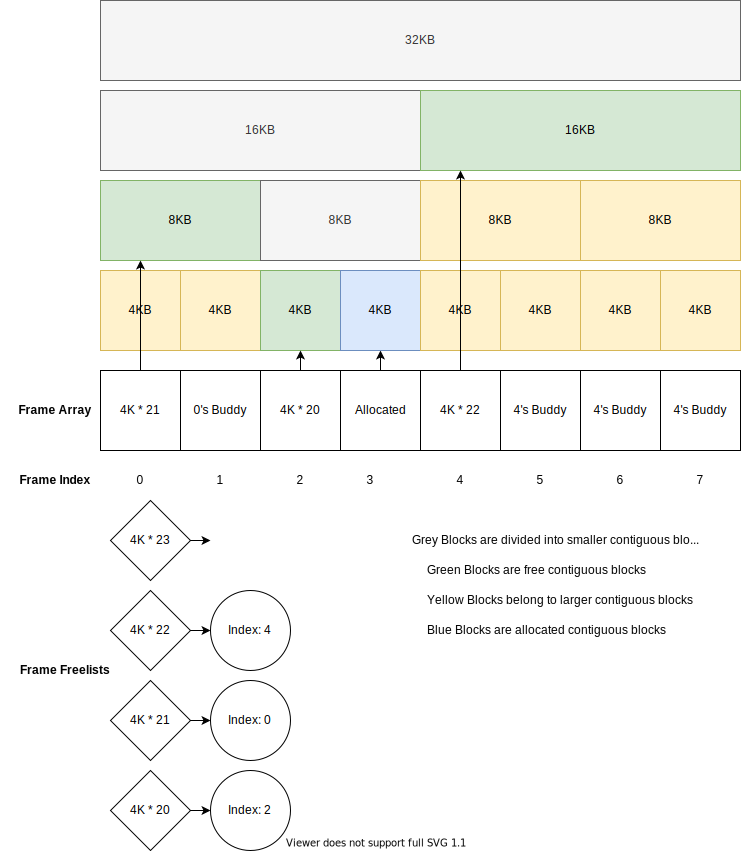

Lab 4
---

## Target
- 完成 page frame allocator (buddy system) 。
- 完成 dynamic memory allocator 。
- 完成 startup allocator 。

## Page Frame Allocator
- 切分: 將 memory 切分成 4KB 的 page 。
- 合併: 將 page 遞迴的合併成包含 `2^n` 個 page 的 frame 。
  - 圖中 block `0` 跟 block `1` 合併包含 2 個 page 的 frame 。
  - 圖中 block `4` (包含 page `4` 跟 `5`) 跟 block `6` (包含 page `6` 跟 `7`) 合併成包含 4 個 page 的 frame 。
  - 因為 buddy system 中保證 memory 連續，因此 block `n` 只能跟 block `n ^ (1 << order)` 合併，合併後 `order + 1` ，包含 `1 << order` 個 page 。
- Allocate: 在 buddy system 中，會維護 freelist ，紀錄未被使用的 frame ，需要 alloc 時，從中查詢取得。
  - 會盡量分配與需求相近的的 frame ，如 alloc 3 page ，分配 `order=2 (4 page)` 的 frame ，alloc 100 page ，則分配 `order=7 (128 page)` 的 frame 。
  - 有時候 freelist 中對應 `order` 的 list 是空的，則會找更高等級且不為空的 list ，將其 frame 分解，再進行 alloc 。
- Release: 當 release frame 時會重新記錄回 freelist ，若能跟 buddy block 合併，則會合併致不能合併為止。



## Dynamic Memory Allocator
- Page frame allocator 雖然很大程度解決 memory 分配的問題，但每次分配最少都是 4KB ，對小的 alloc 來說相當浪費，因此需要一個 dynamic allcoator 來處理。
- Dynamic allocator 相當於原本 page 系統上的一個 wrapper ，特別處理 32 、 64 、 128 、 ...... bytes 的大小的 alloc 。

## Startup Allocator
- Allocator 的 state 需要空間紀錄，如 frame 的 `order` 或是否已被使用的狀態等等，但在 initial allocator 前又沒有辦法分配 memory ，因此額外設立一個 startup allocator ，在 allocator 處理好前直接硬性分配 memory 。

## Reserved Memory
- 在 OS 中，有很多 memory 是早已被系統使用的，不能被 buddy system 分配出去，因此初始化時要進行保留(把 state 設為 `INUSE`)，以避免後續系統 memory 被覆蓋。
- 以下事實作中保留的 address:
  - `0` - `0x1000`: Spin tables for multicore boot 。
  - `0x1000` - `0x80000`: Kernel Image 。
  - `CPIO_BASE` - `CPIO_BASE + 72000`: Initramfs 。
  - `0x6000000` - `0x8000000`: Startup allocator 。

## Makefile
```sh
make run    # run code with qemu
make debug  # run code with gdb
make build  # build kernel8.img, may not be called directed
make clean  # delete build folder
```